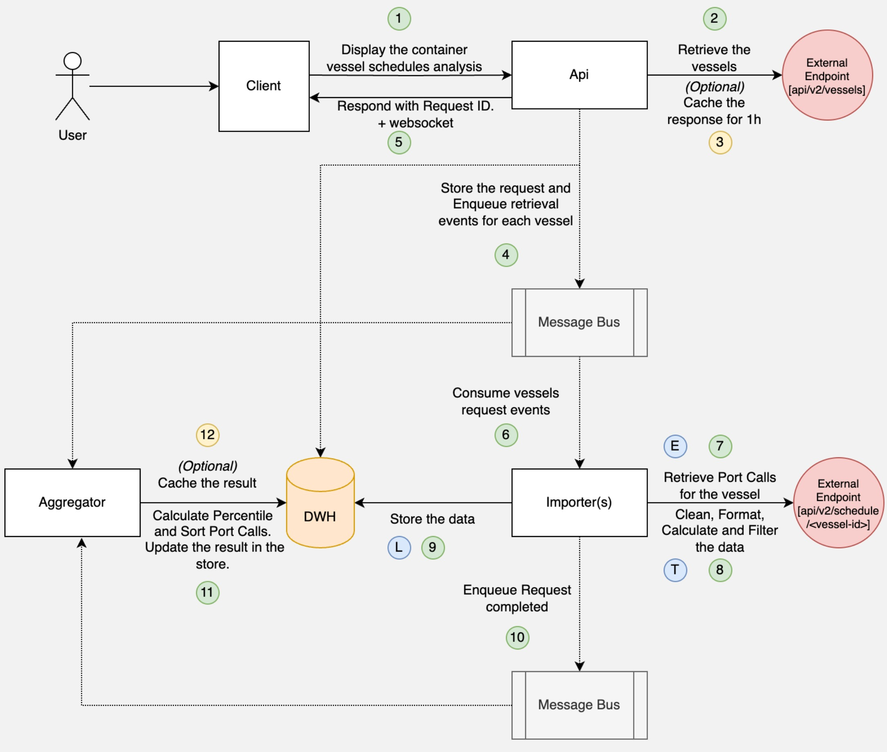

# Port Calls Analysis

This project aims to import and analyze container vessel schedules to optimize port operations, enhance logistics planning, and enable data-driven decision-making.


## Features

-   Import vessel schedules from an external data source
-   Display statistics for the five ports with the most and fewest port calls, with the number of port calls for each of these five ports.
-   For each port, the percentiles of port call durations: 5th, 20th, 50th, 75th and 90th percentiles.

## Design Options

### Option 1:

This design option is highly scalable for large datasets, with an event-driven pipeline. The option was not chosen due to its complexity and the time constraint.



### Option 2:

The pipeline can be build using data technologies like Apache Airflow, Spark, Kubeflow; or with Streaming Processing like Apache Flink or KStream; However, this option was not chosen to showcase programming skills.

### Option 3: (SELECTED)

Simple **Asynchronous Batch Processing** approach. This approach involves processing data in predefined batches, allowing for parallel execution of tasks. Unlike the event-driven or Airflow-based solutions, this method offers a more straightforward implementation but may lack the scalability and flexibility required for large or complex workflows.

FrontEnd: apps/portcalls-analyzer-dashboard

BackEnd: apps/portcalls-analyzer-api

## Getting Started

### Tech Stack

**Client:** Next.js

**Server:** Node, Fastify

**Continues Integration** Github Workflows

**Others** Jest, NX, Eslint, Prettier

**Continues Deployment** (Not used: Without using Docker or Serverless)

### Run Locally

Clone the project

```bash
  git clone https://github.com/mostafa-safwat-staff/portchain
```

Go to the project directory

```bash
  cd portchain
```

Install dependencies

```bash
  npm install
```

Build the Apps

```bash
  npm run build
```

Start the app

```bash
  npm run start
```

### Running Tests

To run e2e tests, run the following command

```bash
  npm run test:e2e
```

Note: Ensure the application is running by executing npm run start beforehand.


## Other commands

```bash
  npm run lint
  npm run format
```

## API Reference

#### Get statistics

```http
  GET /api/statistics
```

Response Example: 

```json
{
  "top5Ports": [
    ["DEHAM", 23],
    ["MAPTM", 14],
    ["JPTYO", 14],
    ["BEANR", 11],
    ["TWKHH", 11]
  ],
  "bottom5Ports": [
    ["VNHPH", 1],
    ["INHZR", 1],
    ["INMUN", 1],
    ["ESVLC", 1],
    ["CNTNG", 1]
  ],
  "portDurationStatistics": [
    {
      "5": "17.00",
      "20": "22.80",
      "50": "24.90",
      "75": "34.26",
      "90": "38.00",
      "port": "BEANR"
    },
    {
      "5": "12.15",
      "20": "14.00",
      "50": "22.50",
      "75": "39.25",
      "90": "53.40",
      "port": "DEHAM"
    },
    ...
  ]
}
```

## Author

-   [@Moustafa Kotb](https://www.linkedin.com/in/moustafase/)
